<div align="center">

<a name="top"></a>

<br>

<a href="#about"><b>About</b></a> &nbsp;·&nbsp;
<a href="#projects"><b>Projects</b></a> &nbsp;·&nbsp;
<a href="#certifications"><b>Certifications</b></a> &nbsp;·&nbsp;
<a href="#toolkit"><b>Toolkit</b></a> &nbsp;·&nbsp;
<a href="#more"><b>Also built</b></a> &nbsp;·&nbsp;
<a href="#contact"><b>Contact</b></a>

<br><br>

<a href="mailto:shehab6157@gmail.com"></a>
<a href="https://www.linkedin.com/in/shehab-shibli"></a>
<a href="https://shehab6157-design.github.io"></a>

</div>


<a name="about"></a>
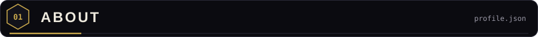

I'm a network engineering and cybersecurity graduate who builds detection systems, tests them against **real data**, and writes down where they fail. My work ranges from a Raspberry Pi running computer vision on a road, to a bee-inspired intrusion detector measured on Los Alamos network data.

```json
{
  "name": "Shehab Shibli",
  "role": "Network & Cybersecurity Engineer",
  "education": "B.Sc. Network Engineering & Cybersecurity, JUST (2025)",
  "certified": ["CCNA", "AWS Certified Cloud Practitioner"],
  "languages": { "Arabic": "native", "English": "fluent", "Hebrew": "conversational" },
  "location": "Northern Israel, open to relocation",
  "status": "open to work",
  "availability": "immediately, onsite / hybrid / remote",
  "how_i_work": ["measure on real data", "publish the failures", "make every alert explainable"]
}
```

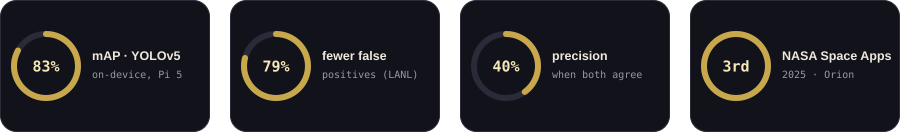

<br>

| When | Where | What |
|:--|:--|:--|
| **2025 – now** | Independent Security & AI R&D | Designing, building and validating my own security tooling end to end: APIS, phishing detection, ScamShield. |
| **2024 – 2025** | Graduation Project Lead, JUST | Led a five-person team building a real-time, edge-to-cloud animal detection system (Top 100 nationally). |
| **3 months** | Backend Development Intern, Hope Company | C#, SQL and ASP.NET Core in a structured team-sprint environment. |
| **3 months** | Linux & Enterprise Systems Trainee, SkyTech | SUSE Linux administration and troubleshooting; SAP Business One and SAP HANA exposure. |
| **2019 – 2025** | B.Sc. Network Engineering & Cybersecurity, JUST | 160 credit hours, Faculty of Computer & Information Technology. |

**Recognition:** 🥉 3rd place, NASA Space Apps Challenge 2025 (Team Orion) &nbsp;·&nbsp; 🏅 Top 100, 12th National Technology Parade (Jordan) &nbsp;·&nbsp; 🌍 Invited participant, World Space Week 2025


<a name="projects"></a>
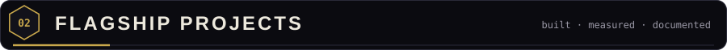

### 01 · On-Road Real-Time Animal Detection & Alert System


A Raspberry Pi 5 on the roadside watches for animals with a custom-trained YOLOv5 model. When it detects one, it sounds an onboard alert, takes a GPS fix from a SIM7600 LTE module and publishes the event over MQTT/TLS to AWS IoT Core. A Lambda function then applies the Haversine formula to find every vehicle within 1 km and warns them through SNS.

- **Model:** custom YOLOv5 fine-tuned on 10,108 images of sheep, cows, dogs and horses, reaching **83% mAP running on the Pi 5**.
- **My role:** team leader of five. I designed the full architecture from sensor to cloud, trained the model and integrated the AWS pipeline.
- **Recognition:** graduation project at JUST (2024–2025), selected in the **Top 100 at the 12th National Technology Parade**.
- **Stack:** `YOLOv5` `Raspberry Pi 5` `MQTT/TLS` `AWS IoT Core` `Lambda` `SNS` `DynamoDB` `X.509 auth` `Python`
- **Repo:** [on-road-animal-detection-system](https://github.com/shehab6157-design/on-road-animal-detection-system)

<br>

### 02 · S.O.S: Sustainable Orbit Sweeper


A concept for a modular satellite that actively cleans debris from low Earth orbit. Small debris is captured with a net-and-gel mechanism, larger fragments are handled by a laser array, and a recycling unit and research core ride on board. The long-term vision is a fleet of 50 units by 2040. My team, **Team Orion, placed 3rd at the NASA Space Apps Challenge 2025**.

- **My role:** co-designed the concept and led the concept documentation and the mission-architecture presentation.
- **Also:** invited participant at World Space Week 2025 (Aeronautical Engineering Department, JUST).
- **Skills:** systems design, mission architecture, technical writing.
- **Repo:** [sos-sustainable-orbit-sweeper](https://github.com/shehab6157-design/sos-sustainable-orbit-sweeper)

<br>

### 03 · ScamShield: encrypted messenger with built-in scam detection


Encrypted messengers protect the channel, not the person reading it. ScamShield makes scam and phishing detection a **native layer of the chat** instead of a bolt-on. It runs on the Matrix protocol with a self-hosted Dendrite homeserver and a custom client (deliberately not a fork of Element, to avoid its AGPLv3 obligations), and it reuses the detection engine from my Hebrew/Arabic phishing detector.

- **Status:** working end-to-end prototype. The homeserver, client and detection pipeline are live; the detector is currently a rule-based stub awaiting a full trained model.
- **Stack:** `Matrix` `Dendrite` `E2EE` `Docker`
- **Repo:** [scamshield](https://github.com/shehab6157-design/scamshield)

<br>

### 04 · APIS: Adaptive Protective Immune System


A lateral-movement, credential-theft and AI-agent detector modeled on a honeybee colony's defenses. Its one hard rule: **no single signal is ever actionable on its own**. An alert needs either the same pattern repeating or two genuinely different kinds of suspicious behavior together.

Most intrusion-detection demos run on data their author generated. APIS was measured on the **Los Alamos National Laboratory** multi-source cyber-security dataset: 17,684 real computers, 58 days of traffic, and a real red-team engagement labelled by someone who never saw the code.

- **Network flows:** false positives cut from 2,896 to 603 (**−79.2%**); precision from 0.62% to 2.11%.
- **Identity and credential theft:** false positives cut from 38,131 to 7,991 (**−79.0%**) at a 96.0% detection rate.
- **Both agree:** precision reaches 40.0%, roughly **19×** better than either detector alone.
- **AI-agent layer:** detects agents hijacked by indirect prompt injection, evaluated on 576 real tool calls. The first rule was falsified when the workload changed, then rebuilt on a structural hypothesis and re-tested on unseen sessions.
- **Hardening:** SHA-256 hash-chained audit trail, flood-evasion tests, MITRE ATT&CK / ATLAS mapping, **231 tests**.
- **Honest limits:** known evasions are kept in the test suite on purpose, and the agent-layer detection rate comes from constructed scenarios and is labelled as such.
- **Repo:** [apis-lateral-movement-detector](https://github.com/shehab6157-design/apis-lateral-movement-detector) · [project site](https://shehab6157-design.github.io/apis-lateral-movement-detector/)


<a name="certifications"></a>
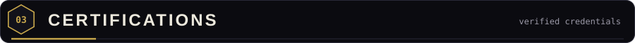



<a name="toolkit"></a>
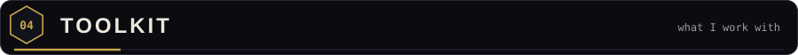



<a name="more"></a>
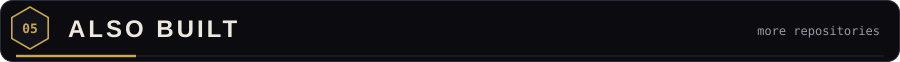

| Project | What it is | Links |
|:--|:--|:--|
| **QR Risk Signal** | Content-based risk score for QR-code phishing ("quishing"): 9 client-side checks return a transparent 0–100 score with reasons, not a black box. | [Repo](https://github.com/shehab6157-design/QR-risk-demo) · [Live demo](https://shehab6157-design.github.io/QR-risk-demo/index.html) |
| **AI Phishing Detector** | Layered detector (TF-IDF baseline, behavioral rules, sender history) built to show, and close, the gap where content-only classifiers miss well-written AI phishing. | [Repo](https://github.com/shehab6157-design/ai-phishing-detector) |
| **Hebrew/Arabic Phishing & Scam Detector** | NLP classifier for the languages most Western tools ignore, with a live interactive demo. | [Portfolio](https://shehab6157-design.github.io) |
| **Lateral Movement Detector** | Per-device behavioral baseline validated on a self-hosted 3-VM network; the lab-built ancestor of APIS. | [Repo](https://github.com/shehab6157-design/lateral-movement-detector) |
| **Personal AI Assistant** | Full-stack assistant on the Claude API (FastAPI, SQLite, persistent memory). | [Repo](https://github.com/shehab6157-design/personal-assistant) |


<a name="contact"></a>
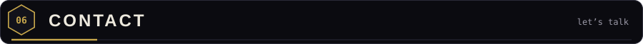

<div align="center">

<b>Open to work</b> · available immediately · onsite, hybrid or remote · open to relocation

<br>

<a href="mailto:shehab6157@gmail.com"></a>
<a href="tel:+972507848250"></a>
<br>
<a href="https://www.linkedin.com/in/shehab-shibli"></a>
<a href="https://shehab6157-design.github.io"></a>

<br><br>


</div>
